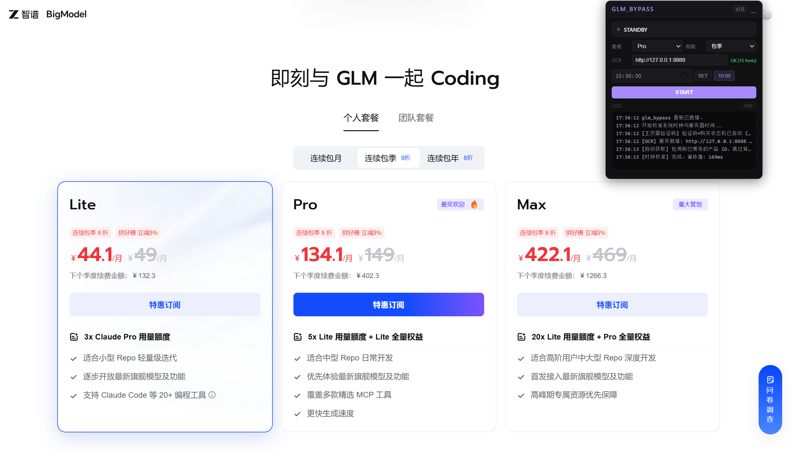

# glm_bypass

智谱 GLM Coding Plan 限时抢购自动化工具（Tampermonkey 油猴脚本 + 本地验证码识别服务）】



## 功能特点

- **双轨并行引擎** — 验证码流程 + 均匀重试引擎同步运行，ticket 池自动积累复用
- **验证码自动识别** — ddddocr 目标检测 + 5 种预处理集成投票 + HOG 特征匹配双引擎融合
- **手动点击即激活** — 点击页面购买按钮自动接管，也可通过面板按钮或定时触发
- **服务器时钟校准** — HEAD 请求对比本地与服务器时间差，毫秒级精度
- **预求解验证码** — 提前 2.5 秒触发验证码识别，到点时 preview 直接落在 T+0
- **WAF 拦截检测** — fetch/XHR/重试引擎三层 405/403 HTML 检测，触发后锁定仅页面刷新恢复
- **完整停止信号** — 停止按钮渗透所有异步层（OCR、重试引擎、QR 检测、状态机）
- **反检测** — 请求指纹随机化、toString 伪装、Shadow DOM 面板隔离
- **支付恢复** — 清弹窗 → 缓存重点击 → 直接获取支付链接 → 兜底提醒
- **配置持久化** — localStorage 保存配置，sessionStorage 保存请求参数，刷新不丢失

## 项目结构

```
GLM_bypass/
├── glm_bypass.user.js    # 油猴脚本（主程序，Tampermonkey 安装此文件）
├── captcha_server.py      # 本地验证码识别服务（ddddocr + HOG）
├── requirements.txt       # Python 依赖（flask, ddddocr, opencv 等）
├── start.cmd              # Windows 一键启动验证码服务（双击即可）
├── README.png             # 项目截图
└── README.md              # 本文档
```

## 快速开始

### 1. 安装 Python 依赖

```bash
pip install -r requirements.txt
```

需要 Python 3.8+，主要依赖：

- `ddddocr` — 验证码检测与 OCR
- `flask` — HTTP 服务
- `opencv-python-headless` — 图像预处理
- `Pillow` — 图像处理
- `numpy` — 数值计算

### 2. 启动验证码识别服务

```bash
python captcha_server.py
```

或双击 `start.cmd`（Windows）

服务默认监听 `http://127.0.0.1:8888`，启动后会自动扫描系统中文字体用于 HOG 特征匹配。

验证服务是否正常：

```bash
curl http://127.0.0.1:8888/health
# 返回: {"status":"ok","engine":"ddddocr","fonts":N}
```

### 3. 安装油猴脚本

#### 3.1 安装 Tampermonkey 扩展

支持 Chrome 和 Edge 浏览器。

1. 打开 [Tampermonkey 官网](https://www.tampermonkey.net/)，点击安装
2. 安装完成后，浏览器右上角出现 Tampermonkey 图标

#### 3.2 安装脚本

1. 点击浏览器右上角 Tampermonkey 图标 → **添加新脚本**
2. 清空编辑器中的默认内容
3. 用文本编辑器打开 `glm_bypass.user.js`，复制全部内容
4. 粘贴到 Tampermonkey 编辑器中
5. 按 `Ctrl + S` 保存
6. 确认脚本状态为**已启用**（Tampermonkey 图标上显示数字 1）

#### 3.3 Chrome 额外设置（重要）

如果脚本安装后不运行，请检查：

1. 打开 `chrome://extensions`，右上角开启**开发者模式**
2. 找到 Tampermonkey，点击**详情**
3. 确认以下选项已开启：
   - **允许用户脚本**
   - **允许在无痕模式下启用**（如果使用无痕窗口）
   - **允许访问文件网址**

### 4. 使用方式

#### 方式一：手动抢购

1. 打开 [GLM Coding 页面](https://open.bigmodel.cn/glm-coding)，确保已登录
2. 直接点击页面上的**购买按钮**
3. 脚本自动接管：识别验证码 → 提交 → 售罄则自动重试
4. 抢购成功后自动弹出支付二维码，扫码付款

#### 方式二：面板触发

1. 打开页面后，右上角出现控制面板
2. 点击面板上的 **START** 按钮开始抢购
3. 脚本自动完成验证码识别和重试循环

#### 方式三：定时抢购（推荐）

1. 打开页面后脚本自动校准时钟并设定 **10:00:00** 定时
2. 提前 2.5 秒自动触发验证码识别（预求解）
3. 10:00:00 准时发起 preview 请求
4. 成功后自动弹出支付二维码

## 工作流程

```
触发抢购（手动/面板/定时）
         ↓
    点击购买按钮
         ↓
  验证码弹窗自动识别（OCR + HOG）
         ↓
    验证通过 → preview 请求
         ↓
    ┌── 成功 ──→ 支付二维码 → 扫码付款
    │
    └── 售罄/555 ──→ 双轨并行
          ├── Track A: 均匀重试引擎（800ms/次，ticket 池轮换）
          └── Track B: 关闭弹窗 → 点击购买 → 新验证码 → 新 ticket 入池
                ↓
              成功 → 支付二维码
```

## 配置参数

脚本内置配置，可在 `CFG` 对象中修改：

| 参数 | 默认值 | 说明 |
|------|--------|------|
| `targetHour` | 10 | 定时抢购小时 |
| `targetMinute` | 0 | 定时抢购分钟 |
| `preSolveMs` | 2500 | 提前多少毫秒预求解验证码 |
| `retryIntervalMs` | 800 | 重试引擎请求间隔（ms） |
| `retryTicketTTL` | 170000 | ticket 有效期（ms） |
| `retryTimeout` | 5000 | 单次请求超时（ms） |

## 验证码识别原理

### 检测阶段

使用 ddddocr det 模型定位图片中所有汉字区域。

### OCR 集成投票

对每个检测区域，用 5 种图像预处理（原图、Otsu 二值化、CLAHE 增强、反色、高斯+Otsu）分别 OCR，投票选出最佳结果。

### HOG 特征匹配

用系统中文字体渲染提示字，生成多字体 × 多尺寸 × 多角度变体，提取 HOG 特征向量，与检测区域的 HOG 特征做余弦相似度匹配。

### 综合评分

OCR 投票结果 + HOG 图像相似度加权融合，全排列搜索最优分配方案。

## 注意事项

- 验证码识别服务必须先启动，否则 OCR 功能不可用
- 如果触发 WAF 拦截（405），需更换 IP 后刷新页面
- 停止按钮会终止所有异步活动，只有重新开始或刷新页面才能恢复
- 非抢购时段测试时，preview 会返回售罄，属于正常现象
- 看到没有金额的支付页面 = 没抢到，需关闭继续

## 抢购步骤

1. **9:55 前** — 启动验证码服务（双击 `start.cmd` 或命令行启动）
2. **9:55** — 打开 [GLM Coding 页面](https://open.bigmodel.cn/glm-coding)，确保已登录
3. 等待右上角出现控制面板，确认显示"面板已就绪"和"OCR 服务就绪"
4. 脚本自动校准时钟、检测产品 ID、设定 10:00 定时
5. **10:00** — 脚本自动开始：预求解验证码 → 点击购买 → 提交 → 重试
6. 也可随时手动点击页面**购买按钮**或面板 **START** 按钮
7. 抢购成功后自动弹出支付二维码，扫码付款
8. 如果没抢到，脚本会持续重试直到成功或手动停止

## 常见问题

### 脚本安装后不运行

1. 确认 Tampermonkey 已启用（右上角图标有数字）
2. Chrome 用户打开 `chrome://extensions` → 开启**开发者模式**
3. 找到 Tampermonkey → 详情 → 开启**允许用户脚本**

### 面板显示"OCR 服务未连接"

验证码服务未启动或端口不对。确认：

```bash
curl http://127.0.0.1:8888/health
```

返回 `{"status":"ok",...}` 即正常。

### 触发 WAF 拦截

日志显示 `IP被WAF拦截(405)`，说明请求频率被服务器检测。解决方法：

1. 更换 IP（切换网络或使用代理）
2. 刷新页面
3. 重新开始抢购

### 非抢购时段测试

非 10:00 时段，preview 请求会返回"售罄"，验证码通过后不会弹出二维码。这是正常现象，说明脚本流程在正常工作。

## 免责声明

本脚本仅供个人学习研究使用。使用本脚本可能违反平台服务条款，导致账号被限制。用户需自行承担一切风险和后果。

## License

MIT
